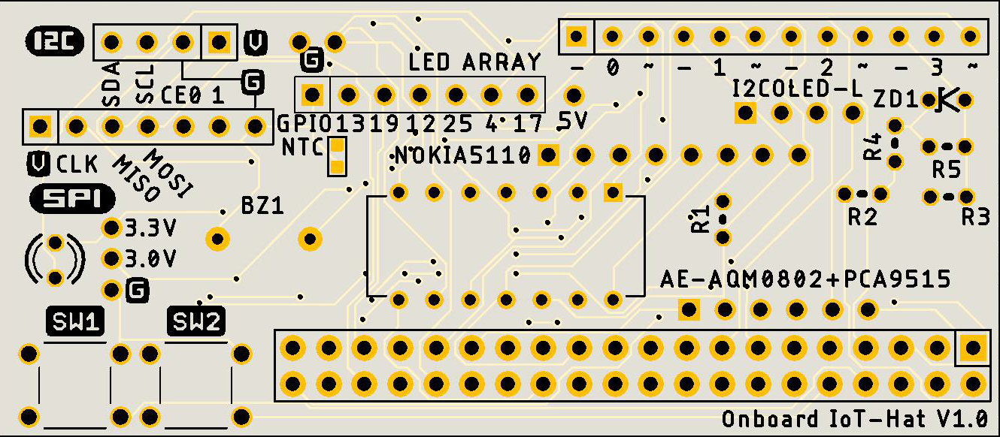
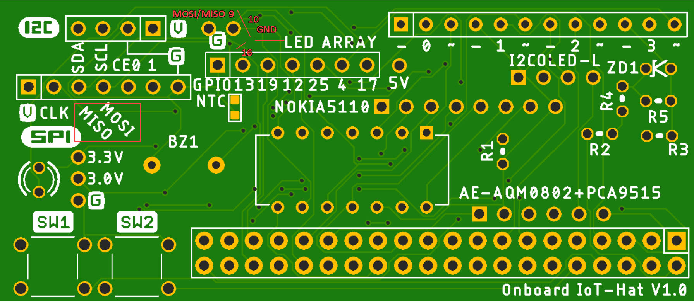
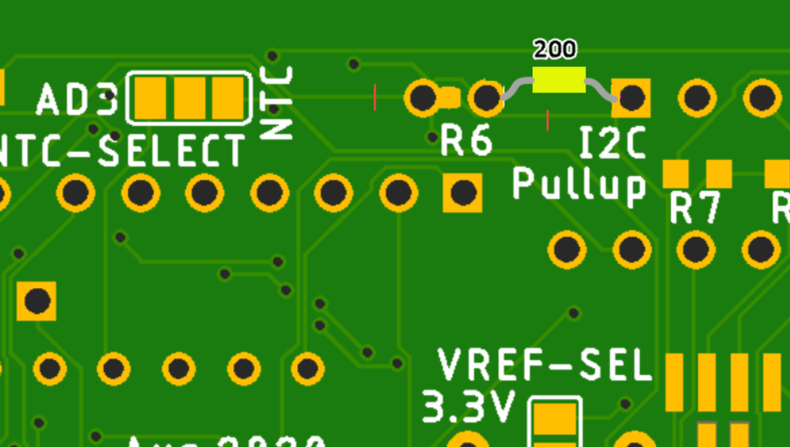

# IoT sensor using RaspberryPI Zero v1.0

## Overview
- A IoT devices for measuring soil moisture, temperature and humidity and taking fixed-point camera images for gardening

## Built with
- Raspberry Pi Zero
- [Gpiozero](https://gpiozero.readthedocs.io/en/stable/index.html)
- Python3
- VSCode
- Windows 10
- [SSH FS](https://marketplace.visualstudio.com/items?itemName=Kelvin.vscode-sshfs)

# Parts
- R7,R8,R9 10k Resistor 0603
- R2,R5 1k Resistor  0204V
- SW1,SW2 TactSwitch B3F-1000
- ZD1 Zener diode [3.0V](https://akizukidenshi.com/catalog/g/gI-07490/)
- R6 Resistor [200](https://akizukidenshi.com/catalog/g/gR-08526/) 0603
- R4 Resistor 100 0204V
- R3 Resistor 1.5k 0204V
- R1 Resistor 1k 0204V
- MCP3004
- BZ1 Buzzer
- NTC [NCP18XH103F03RB](https://akizukidenshi.com/catalog/g/gP-05252/)
- 

    0204 through hole 0.25W short-type Resistor

optional

- [NOKIA5110 LCD](https://www.aliexpress.com/item/32834442545.html?spm=a2g0o.productlist.0.0.32a4bed7RuGeyx&algo_pvid=416b30bc-1538-45dc-821e-8d7337321b34&algo_expid=416b30bc-1538-45dc-821e-8d7337321b34-1&btsid=0bb0624516144809783815480eb11d&ws_ab_test=searchweb0_0,searchweb201602_,searchweb201603_)
- [OLED (I2C)](https://www.aliexpress.com/item/1005001581640707.html?spm=a2g0o.productlist.0.0.4ce130d5xvluW3&algo_pvid=26424330-9a53-484c-af58-e9a62246c99f&algo_expid=26424330-9a53-484c-af58-e9a62246c99f-5&btsid=0bb0620316144809303381173e40a4&ws_ab_test=searchweb0_0,searchweb201602_,searchweb201603_)
- [LED array](https://www.aliexpress.com/item/32273206116.html)

## Fix PCB

